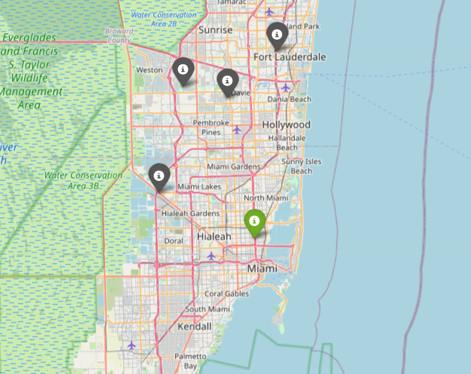

```python

```

\begin{center}
\begin{huge}
DATA203 Foundational Python (Prof. Maull) / Spring 2026 / HW3
\end{huge}
\end{center}

| Points <br/>Possible | Due Date | Time Commitment <br/>(estimated) |
|:---------------:|:--------:|:---------------:|
| 25 | Thursday, April 23 @ midnight | _up to_ 15 hours |


* **GRADING:** Grading will be aligned with the completeness of the objectives.

* **INDEPENDENT WORK:** Copying, cheating, plagiarism  and academic dishonesty _are not tolerated_ by University or course policy.  Please see the syllabus for the full departmental and University statement on the academic code of honor.

## OBJECTIVES
* Explore air quality public dataset in Python and Pandas.

* Build a distance table using Pandas.

* Build a map of reference and Purple Air stations using Folium.

## WHAT TO TURN IN
You will enjoy the highest benefits of the starter notebook
if you clone the HW Github repository from your Jupyter Hub
terminal with the command:

```bash
  git clone https://github.com/kmhuads/s26_data203.git
``` 

This will ensure you have the most updated files and starter 
notebook.

Once you have cloned the repository, you can edit the
starter notebook with your solution code.

When you are done with your work, it will be best to zip
your `hw2` folder and all sub-folders with the terminal command
(one level outside your notebook folder):

``` bash
  zip -r data203_hw3_maull.zip ./hw3
 ```

This will produce the file with all necessary supporting files
(notebooks, data output, etc.) 
then
download it from the Jupyter Hub to your local machine, 
then upload the `.zip` to Teams.

If you are confused on how to do this, please ask, 
or visit one of the many tutorials
on the basics of using zip in Linux.  

If you choose not to use the provided notebook, you will still need to turn in a
`.ipynb` Jupyter Notebook and corresponding files according to the instructions in
this homework.


## ASSIGNMENT TASKS
### (20%) Explore air quality public dataset in Python and Pandas. 


Now that we have learned a number of new 
concepts in Pandas is it time to apply them.

We are going to explore a few preliminaries 
before getting into our exploration and code 
solution.

You might already be aware of the work going 
on in CADSA and elsewhere to study the 
community-level impacts of high
temperatures in urban environments, as 
well as how poor air quality significantly
[impacts the health](https://www.epa.gov/pm-pollution/health-and-environmental-effects-particulate-matter-pm) of us all (but especially
developing children and the elderly).  You
may also have some awareness that addressing
these issues is as much a data problem as it 
is a political one -- without appropriate
data collection and analysis, very little can
get accomplished at the policy level.

One source of data are government sources, such
as the EPA ([https://epa.gov](https://epa.gov))
and as you may also be aware, data feeds for the
EPA data products have been threatened in the
recent past:

* Sellers, C., Dillon, L., Ohayon, J. L., Shapiro, N., Sullivan, M., Amoss, C., Bocking, S., Brown, P., De la Rosa, V., Harrison, J., Johns, S., Kulik, K., Lave, R., Murphy, M., Piper, L., Richter, L., Wylie, S., EDGI. (2017, June 19). The EPA Under Siege. Retrieved from [https://envirodatagov.org/publication/the-epa-under-siege](https://envirodatagov.org/publication/the-epa-under-siege)
* [Disappearing Data: Trump Administration Removing Climate Information from Government Websites](https://nsarchive.gwu.edu/briefing-book/climate-change-transparency-project-foia/2025-02-06/disappearing-data-trump) 
* ['We’re willfully blinding ourselves': Mass. researchers worry as federal environmental data disappears](https://www.wbur.org/news/2025/08/14/trump-epa-data-removed-dei-environmental-justice-health-research)

As a data scientist, we must be tirelessly curious
and follow the data, wherever we can find it and
wherever it may lead.

Being familiar with many datasets, large or small, 
and becoming curious about the contents and
questions that can be asked about _any_ data
is a skill that will cultivate as it 
serves your future growth.

In the spirit of time, a large portion of the 
data acquisition has been done already, but 
the primary sources are still available for
you to peruse.  The two sources are OpenAQ 
and PurpleAir.  [OpenAQ](https://openaq.org)
is a website that aggregates global air quality
data from a variety of sources, but of interest
to us are the data about the reference or "government"
monitors, as we will shortly see.  [PurpleAir](https://purpleair.com)
is a company that sells air quality monitors which can
continuosly collect and display real-time data
about [PM2.5 air quality](https://www.epa.gov/AQNE/air-quality-index-and-real-time-air-quality-data) parameters.

_You are encouraged to independently explore these data sources_.

In this assignment we are going to use Pandas to work through 
location data using these two data sources.

**&#167; Task:**  **1.1 Install the OpenAQ Python module from [PyPi.org](https://pypi.org).**

You will need to install the `openaq` module with:

```
!pip install openaq
```


**&#167; Task:**  **1.2 Study the provided `fetch_openaq_data()` function in the provided starter notebook and describe what it does.**

Write in your notebook what the function does.  You will want to study
the OpenAQ documentation here:

* [OpenAQ Python module documentation](https://python.openaq.org/how-to-guides/)


**&#167; Task:**  **1.3 Execute the `fetch_openaq_data()` function, study the output JSON file and provide a brief description of its contents.**

Your description should be understandable by one of your peers who **has not taken this course**.
You must use plain descriptions without technical jargon, but you must provide
enough information so that the description is useful.

You **MUST** use the following parameters when invoking the function:

* `lat = 25.986862`
* `lon = -80.208447`
* `outfile = "data.json"`

As a side note, the lat, lon given represents the location 
of an **actual** PurpleAir sensor in use by our partners in 
collaboration with Dr. Yeboah's [Core Futures Lab](https://) here at
Howard.

You **MUST** also sign up for an API key here and use the resulting key in your `key` parameter to the
function call:

* [https://explore.openaq.org/register](https://explore.openaq.org/register)


### (60%) Build a distance table using Pandas. 


We will extend the work we started in the first part and continue 
to explore the data, specifically, we now want to answer a very 
simple question:

_Given the lat,lon information for a Purple Air location, where are 
the closest EPA regulation monitors._

This is a natural question, especially when trying to understand
what coverage already exists and _whether that coverage is adequate
to assess actual air quality impacts for the communities of interest._

**&#167; Task:**  **2.1 Build a table containing all the locations we want to compare.  Explain the table,**

You will need to study the provided function `build_location_table()`.

1. Finish the cell which loads the JSON file from the first part and
execute the function `build_location_table()`.

2. Describe the output of the function.  Be very descriptive of what 
the function does and what the output actually is.


**&#167; Task:**  **2.2 Finish the function implementation of `build_distance_table()`.**

Do not overthink this:

* Study the implementation stub and finish it.
* Your implementation will be a nested `for` loop that will 
  loop over all the values twice and create a list 
  of the distances using the `haversine` function.
  
  For example,
  ```python
  haversine(i,j,Unit.MILES)
  ``` 

  computes the distance in miles between two
  (lat,lon) tuples _i_ and _j_.

  You will simply run a `for` loop inside 
  of a `for` loop which will append
  the computed distance to a list, then `pd.concat()`
  on `axis=1` to
  a new DataFrame consisting
  of the list.  Remember if you have a list
  `lst`, `DataFrame(lst)` creates 
  the new DataFrame that you will `concat`.


**&#167; Task:**  **2.3 Explain the output of `build_distance_table(build_location_table(pa_sensor, data)`.**

Be descriptive but also use plain language that a non-expert 
would understand.


**&#167; Task:**  **2.4 Answer the questions below based on the `n_closest` code given in the notebook.**

**NOTE:** The first parameter to the function is the _index_ of the 
location you want to build the table from.  In the questions below,
please use the value `0`, which is the index of the Purple Air monitor
in question.

Use the function to answer the questions:

1. Which is the closest reference monitor to the Purple Air monitor?
2. Which is the farthest?
3. How many reference monitors are within 2 miles of the Purple Air monitor?
4. What is the mean and median distance of ALL reference monitors to the Purple Air monitor?

For example,
```python
n_closest(0, df, df_dist, n=-1, reference_only=True)
```

returns **all** the reference station's distances to index `0` or
the Purple Air station.  The output is a _tuple_ with the index
of the station and the lat, lon coordinates.


### (20%) Build a map of reference and Purple Air stations using Folium. 


We are almost there.  What's left is to leave the world of
numbers and tables and create an interactive visualization.

The solution is scaffolded so you will have to 
do very little to complete the code.  The goal 
is to see the map!

**&#167; Task:**  **3.1 Install the Folium package from PyPi.**

You will simply run:

```python
!pip install folium
```


**&#167; Task:**  **3.2 Finish the code implementation.**

Most of the code is completed for you in the 
starter notebook.  You will just need to 
study the first bit of code that 
puts the marker on the map, then put it
into the provided loop.  There are hints
in the starter notebook which should set you straight.

Your map will look something like:




